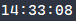
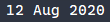
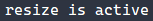
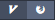
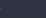
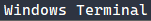
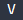

# Bar


The bar is where the most important information about the current state can be found.

You can configure the bar by using the `bar` keyword.

```nog
bar #{
    //configuration
};
```

The bar keyword takes an [object](scripting/types?id=object) which can contain the following properties:

| Key        | Value  | Description                                                          |
|------------|--------|----------------------------------------------------------------------|
| height     | Number | The height of the bar                                                |
| font       | String | The font of the bar                                                  |
| font_size  | Number | The font size of the bar                                             |
| color      | Number | The base color of the bar of which the other colors get derived from |
| components | Map    | A map of the used components (More information is below)             |

It is designed to be completely modular, meaning each "section" you can see in the image at the top of this page is a seperate component (e.g. time).

## Example

```nog
bar #{
    font: "CaskaydiaCove NF",
    font_size: 18,
    components: #{
        left: [C::workspaces()],
        center: [C::time("%T")],
        right: [C::active_mode(), C::padding(5), C::date("%e %b %Y"), C::padding(1)]
    }
};
```

## Components

To use the components provided by default you first have to import them.

```nog
import "nog/components" as C;
```

Defining the components used by the bar can be done by setting `components` which is an [object](scripting/types?id=object) that can contain the following properties

| Key    | Value | Description                      |
|--------|-------|----------------------------------|
| left   | Array | Aligned to the left of the bar   |
| center | Array | Aligned to the center of the bar |
| right  | Array | Aligned to the right of the bar  |

Each property takes an [array](scripting/types?id=array) of components.

```nog
#{
    left: [C::workspaces()],
    center: [C::time("%T")],
    right: [C::active_mode(), C::padding(5), C::date("%e %b %Y"), C::padding(1)]
}
```

Below is the documentation for each component, where it is assumed that the components are imported already as `C`;

### Time



Displays the current time.

#### Arguments

| Position | Value  | Description                                                       |
|----------|--------|-------------------------------------------------------------------|
| 1        | String | A chrono pattern that specifices how the time should be displayed |

#### Usage

```nog
let component = C::time("%T");
```

### Date



Displays the current date.

#### Arguments

| Position | Value  | Description                                                       |
|----------|--------|-------------------------------------------------------------------|
| 1        | String | A chrono pattern that specifices how the date should be displayed |

#### Usage

```nog
let component = C::date("%e %b %Y");
```

### Current Mode



Displays either the current mode or nothing.

#### Arguments

| Position | Value  | Description                                                       |
|----------|--------|-------------------------------------------------------------------|

#### Usage

```nog
let component = C::current_mode();
```

### Workspaces



Displays the active workspaces for the monitor this bar resides on.

#### Arguments

| Position | Value  | Description                                                       |
|----------|--------|-------------------------------------------------------------------|

#### Usage

```nog
let component = C::workspaces();
```

### Padding



Displays spaces.

#### Arguments

| Position | Value  | Description                    |
|----------|--------|--------------------------------|
| 1        | Number | The number of displayed spaces |

#### Usage

```nog
let component = C::padding(5);
```

### Current Window



Displays the title of the focused window in the current workspace.

#### Arguments

| Position | Value  | Description                    |
|----------|--------|--------------------------------|

#### Usage

```nog
let component = C::current_window();
```

### Split Direction



Displays the split direction of the focused window in the current workspace on this display.

#### Arguments

| Position | Value  | Description                                          |
|----------|--------|------------------------------------------------------|
| 1        | String | The text to display when the direction is Vertical   |
| 2        | String | The text to display when the direction is Horizontal |

#### Usage

```nog
let component = C::split_direction("V", "H");
```

### Custom

You can create custom components by using the `create` function provided in the `nog/components` module.

A custom component requires at least two things, a name and a render function that tells nog how to render the component. Anything else is optional and can be configured in the optional object.

The render function has to return an array.

**Example**
```nog
C::create("My Component", || {
    ["Hello World"]
});
```

The text/background color of the component will be the same as the bar.

If you want to customize the color you have to return an array instead of a string.

**Example**
```nog
C::create("My Component", || {
    [0xffffff, -1, "Hello World"]
});
```

The first item is the foreground color of the component, followed by the background color and then the text to be displayed.

Setting the color to -1 tells nog to just use the default color.

You can use the created component like you would use the default components.

**Example**
```nog
let component = C::create("My Component", || {
    ["Hello World"]
});

bar {
    components: #{
        left: [component],
        center: [],
        right: []
    }
}
```

#### Arguments

| Position | Value    | Description                             |
|----------|----------|-----------------------------------------|
| 1        | String   | Name of the component                   |
| 2        | Function | The function that renders the component |
| 3        | Object   | (Optional) Additional configuration     |

The last argument is an object that can contain the following keys:

| Key      | Value    | Description                                                                                          |
|----------|----------|------------------------------------------------------------------------------------------------------|
| on_click | Function | Gets called whenever you click on the item. Setting this also enables hover style for your component |

#### Usage

Simple
```nog
let component = C::create("My Component", || {
    ["Hello World"]
});
```

With on click
```nog
let component = C::create("My Component", || {
    ["Hello World"]
}, || {
    print("Clicked");
});
```
