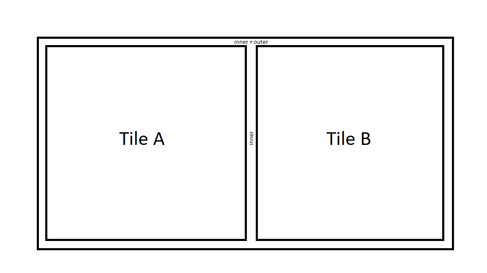

# Gap

There exist two different types of gaps:

* inner
* outer

the inner gap is between the tiles and the outer gap is around the tiles.

**Note**: Due to technical reasons the inner gap has to be added to the outer gap by Nog.

**Visual Representation**

