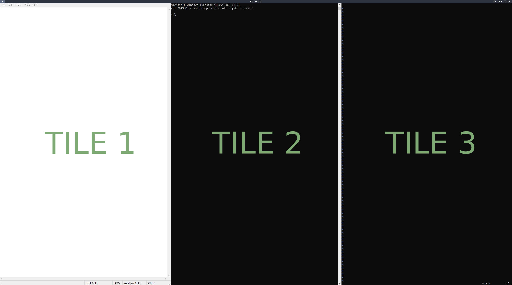
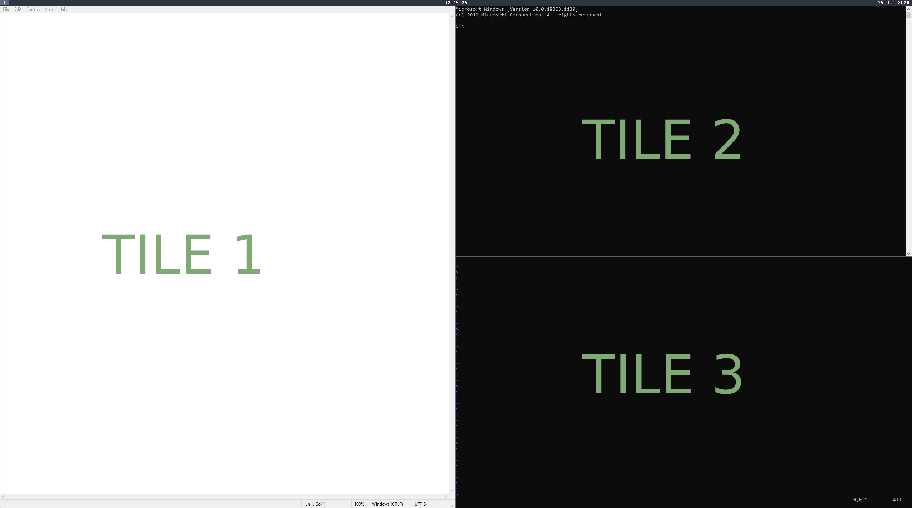
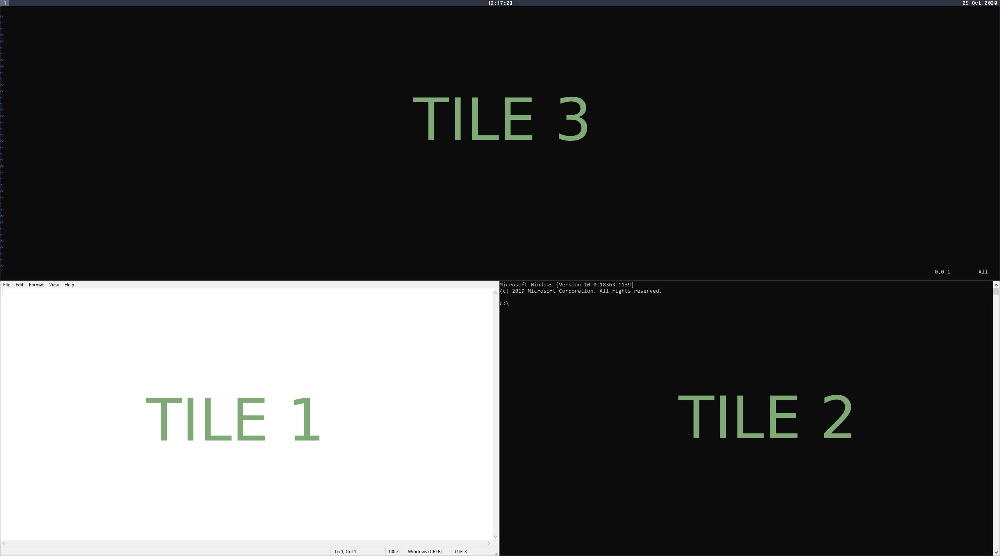

# Keybindings

Defining a keybinding is very simple using the `bind` keyword.

```nog
bind "<key-combo>" <type>;
```

It takes two arguments, a [key combination](configuration/keybindings?id=key-combinations) and a [type](configuration/keybindings?id=types).

If you want to bind a range of things to a type that takes a number as argument, which can happen very fast with [change_workspace](configuration/keybindings?id=change-workspace), you can use the `bind_range` keyword.

```nog
bind_range <start> <end> "<modifiers>" <type>;
```

This keyword takes four arguments:

1. Start of the range (inclusive)
2. End of the range (inclusive)
3. Modifier to use for each keybinding
4. Type to bind to (e.g. `change_workspace` **not** `change_workspace()`) 

It basically does the following (simplified)

```nog
for i in range(start,end+1) {
    bind modifier + i type(i);
}
```

## Examples

### bind

```nog
bind "Alt+H" focus("Left");
```

### bind_range

```nog
bind_range 1 10 "Alt" change_workspace;
```

## Key Combinations

A key combination is written with each part joined by a `+` sign.

```nog
let key_combo = "Alt+Control+A";
```

**Note**: Every key/modifer written below can be used in a combo as written, except ranges (e.g. 0-9).

Because of the limitations of Windows you can only use the following modifiers:

* Alt
* Control
* Shift

And the key can be one of the following:

* A-Z
* 0-9
* Enter
* Plus / Minus
* Left / Up / Right / Down

## Types

A `type` is basically a function that returns some information about how to handle this key combination.

There exist a variety of different types for example changing focus, swapping tiles, ... and so on.

### ChangeWorkspace

Changes the current workspace. 

#### Arguments

| Position | Value  | Description                             |
|----------|--------|-----------------------------------------|
| 1        | Number | Id of the workspace to change to (1-10) |

#### Usage

```nog
bind "<key-combo>" change_workspace(<id>);
```

### MoveToWorkspace

Moves the current tile to a workspace.

#### Arguments

| Position | Value  | Description                                            |
|----------|--------|--------------------------------------------------------|
| 1        | Number | Id of the workspace to move the current tile to (1-10) |

#### Usage

```nog
bind "<key-combo>" move_to_workspace(<id>);
```

### MoveWorkspaceToMonitor

Move the current workspace to a monitor.

#### Arguments

| Position | Value  | Description                                        |
|----------|--------|----------------------------------------------------|
| 1        | Number | Id of the monitor to move the current workspace to |

#### Usage

```nog
bind "<key-combo>" move_workspace_to_monitor(<id>);
```

### MinimizeTile

Unmanages the current tile and minimizes it.

#### Arguments

| Position | Value  | Description                                        |
|----------|--------|----------------------------------------------------|

#### Usage

```nog
bind "<key-combo>" minimize_tile();
```

### CloseTile

If a popup is currently visible then it closes it else it unmanages the current tile and closes it.

#### Arguments

| Position | Value  | Description                                        |
|----------|--------|----------------------------------------------------|

#### Usage

```nog
bind "<key-combo>" close_tile();
```

### IgnoreTile

Unmanages the current window and sets up a rule that ignores the application during the lifetime of the program.

#### Arguments

| Position | Value  | Description                                        |
|----------|--------|----------------------------------------------------|

#### Usage

```nog
bind "<key-combo>" ignore_tile();
```

### Quit

Exits the window manager.

#### Arguments

| Position | Value  | Description                                        |
|----------|--------|----------------------------------------------------|

#### Usage

```nog
bind "<key-combo>" quit();
```

### ToggleFloatingMode

Manages/Unmanages the current window. Ignores all rules.

#### Arguments

| Position | Value  | Description                                        |
|----------|--------|----------------------------------------------------|

#### Usage

```nog
bind "<key-combo>" toggle_floating_mode();
```

### ToggleWorkMode

Toggles the [work mode](getting-started/terminology?id=work-mode).

#### Arguments

| Position | Value  | Description                                        |
|----------|--------|----------------------------------------------------|

#### Usage

```nog
bind "<key-combo>" toggle_work_mode();
```

### ToggleFullscreen

Toggles fullscreen. Fullscreen means that the current tile takes up the whole space of the workspace. 
You can still use all the other keybindings like changing focus or swapping tiles.

#### Arguments

| Position | Value  | Description                                        |
|----------|--------|----------------------------------------------------|

#### Usage

```nog
bind "<key-combo>" toggle_fullscreen();
```

### Focus

Change the focus to the next tile in a direction.

#### Arguments

| Position | Value  | Description                                                   |
|----------|--------|---------------------------------------------------------------|
| 1        | String | The direction which you want to focus to (Left/Right/Up/Down) |

#### Usage

```nog
bind "<key-combo>" focus("<direction>");
```

### Swap

Swaps the current tile with the next tile in a direction

#### Arguments

| Position | Value  | Description                                                       |
|----------|--------|-------------------------------------------------------------------|
| 1        | String | The direction which you want to swap with (Left/Right/Up/Down) |

#### Usage

```nog
bind "<key-combo>" swap("<direction>");
```

### MoveIn
A context-sensitive way of creating a new column or row by moving the focused tile into an adjacent row/column/tile. Performing this action on a tile into an adjacent tile will introduce a new column or row (whichever is the opposite of what the tiles reside in) with the two tiles. Peforming this action on a tile into an adjacent column or row moves the focused tile into the adjacent column or row respectively.

For example, given the following layout with Tile 3 focused...


<p style='text-align:center;'>(Note: "Tile #" label added for demonstration purposes)</p>

Performing a `move_in("Left")` moves the focused Tile 3 _into_ a new row container with Tile 2 in the first position and Tile 3 in the second position.


<p style='text-align:center;'>(Note: "Tile #" label added for demonstration purposes)</p>

#### Arguments

| Position | Value  | Description                                                       |
|----------|--------|-------------------------------------------------------------------|
| 1        | String | The direction which you want to "move_in" the current tile with (Left/Right/Up/Down) |

#### Usage

```nog
bind "<key-combo>" move_in("<direction>");
```

### MoveOut
A context-sensitive way of moving a tile out of a column or row by moving the focused tile into a new row/column. Performing this action on a tile within a row or column will introduce a new column or row (whichever is the opposite of what the tiles reside in) containing only the focused tile. 

For example, given the following layout with Tile 3 focused...


<p style='text-align:center;'>(Note: "Tile #" label added for demonstration purposes)</p>

Performing a `move_out("Up")` moves the focused Tile 3 _out_ of its parent column container and introduces a new parent row container with the focused Tile 3 in the first position and the previous parent column container in the second position.


<p style='text-align:center;'>(Note: "Tile #" label added for demonstration purposes)</p>

#### Arguments

| Position | Value  | Description                                                       |
|----------|--------|-------------------------------------------------------------------|
| 1        | String | The direction which you want to "move_out" the current tile with (Left/Right/Up/Down) |

#### Usage

```nog
bind "<key-combo>" move_out("<direction>");
```

### SwapColumnsAndRows

Turns all columns into rows and all rows into columns.

#### Arguments

| Position | Value  | Description                                                                                 |
|----------|--------|---------------------------------------------------------------------------------------------|

#### Usage

```nog
bind "<key-combo>" swap_columns_and_rows();
```


### Split

Changes the orientation of the current tile. Per default a new tile gets opened vertically.

#### Arguments

| Position | Value  | Description                                               |
|----------|--------|-----------------------------------------------------------|
| 1        | String | New orientation of the current tile (Vertical/Horizontal) |

#### Usage

```nog
bind "<key-combo>" split("<orientation>");
```

### IncrementConfig

Increments a config value that takes a number.

#### Arguments

| Position | Value  | Description              |
|----------|--------|--------------------------|
| 1        | String | Name of the config value |
| 2        | Number | Amount                   |

#### Usage

```nog
bind "<key-combo>" increment_config("<key>", <amount>);
```

### DecrementConfig

Decrements a config value that takes a number.

#### Arguments

| Position | Value  | Description              |
|----------|--------|--------------------------|
| 1        | String | Name of the config value |
| 2        | Number | Amount                   |

#### Usage

```nog
bind "<key-combo>" decrement_config("<key>", <amount>);
```

### ToggleConfig

Toggles a config value that takes a boolean.

#### Arguments

| Position | Value  | Description              |
|----------|--------|--------------------------|
| 1        | String | Name of the config value |

#### Usage

```nog
bind "<key-combo>" toggle_config("<key>");
```

### Launch

Starts a program.

#### Arguments

| Position | Value  | Description                                                                                 |
|----------|--------|---------------------------------------------------------------------------------------------|
| 1        | String | Path to the executable (e.g. "wt.exe" or "C:\\Program Files\\Mozilla Firefox\\firefox.exe") |

#### Usage

```nog
bind "<key-combo>" launch("<path>");
```

### ResetRow

Resets any resizing done on the row the current tile resides on.

#### Arguments

| Position | Value  | Description                                                                                 |
|----------|--------|---------------------------------------------------------------------------------------------|

#### Usage

```nog
bind "<key-combo>" reset_row();
```

### ResetColumn

Resets any resizing done on the column the current tile resides on.

#### Arguments

| Position | Value  | Description                                                                                 |
|----------|--------|---------------------------------------------------------------------------------------------|

#### Usage

```nog
bind "<key-combo>" reset_column();
```

### Callback

Calls a function.

#### Arguments

| Position | Value            | Description               |
|----------|------------------|---------------------------|
| 1        | Function Pointer | The function to be called |

#### Usage

```nog
bind "<key-combo>" callback(|| {
    print("Hello World");
});
```

or 

```nog
fn cb(){
    print("Hello World");
}
bind "<key-combo>" callback(Fn("cb"));
```
