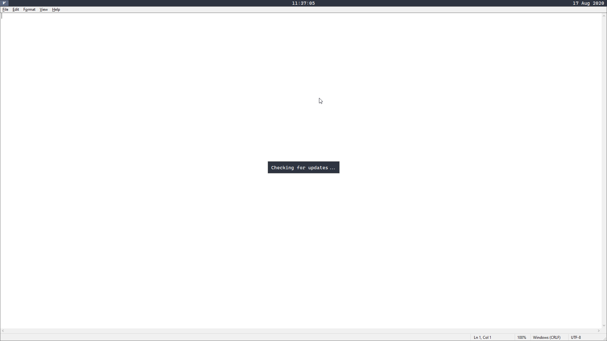

# Popup

A popup is a small window that is centered and adapts its size to the content. The popup uses the bar font, font size and color.



## API

### popup_new

#### Description

Creates a new popup based on the given configuration.

#### Arguments

Takes an [object](scripting/types?id=object) as argument that can have the following properties

| Name    | Value         | Description                                        |
|---------|---------------|----------------------------------------------------|
| text    | Array<String> | A list of strings, where each item is its own line |
| padding | Number        | The padding of the window                          |

#### Usage

```nog
popup_new(#{
    text: ["Hello World"],
    padding: 5
});
```